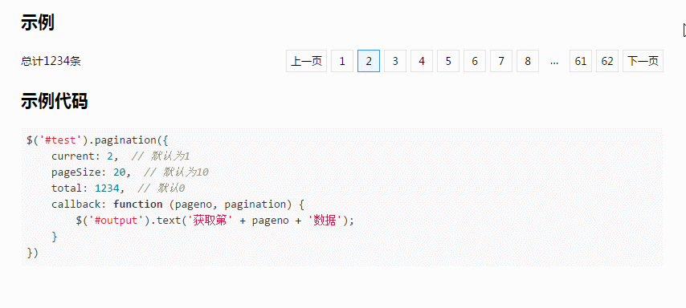

#jquery.pagination
### 极简实用的分页插件，min版小至1k多

## 介绍
- 代码简单，为压缩版不足3k
- 结构简单，自己可以随意修改样式

## 全部配置项
``` javascript
{
    "total": 0,  // 初始化数据总条数，默认为0，初始化时大于0才渲染组件
    "current": 1,  // 初始化时当前页码
    "pageSize": 10, // 每页条数，用于计算总页数
    "ellipsis": '…', // 省略号
    "callback": null  // 页码改变时执行回调
}
```

## 运行效果

## 使用示例
``` javascript
$('.wrap').pagination({
    callback: function (no, pagination) {
        // no是点击的页码
        // pagination是当前组件
        $.ajax({
            url: '',
            data: {
                pageIndex: no,
            },
            success: function (res) {
                // 总数一般是动态的，调用setTotal更新
                pagination.setTotal(res.data.total);
            }
        })
    }
})
```
